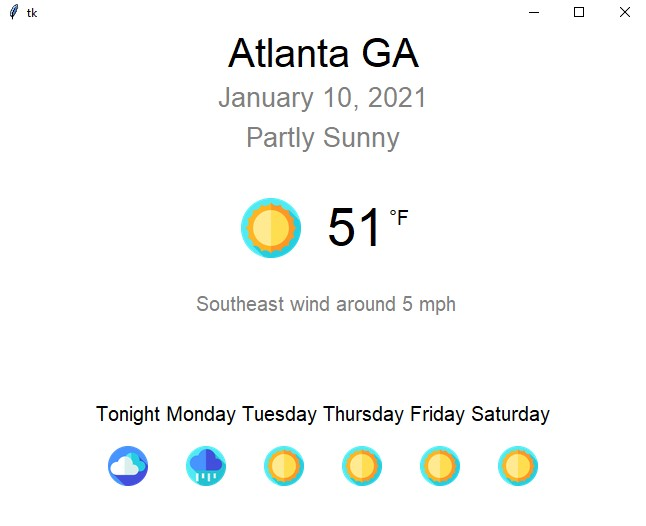

# WeatherGUI
Scrapes weather data using Weather.gov's api and displays it on a GUI

### Icons made by  from 

### GUI_V2.py
Final version of my GUI. Calls WeatherScraper_V3.py and images to display the week's weather forecast

### WeatherScraper_V3.py
Final version of my scraper. Calls Weather.gov's api to collect information about the week's forecast

### images
Contains all the icons GUI_V2.py uses
